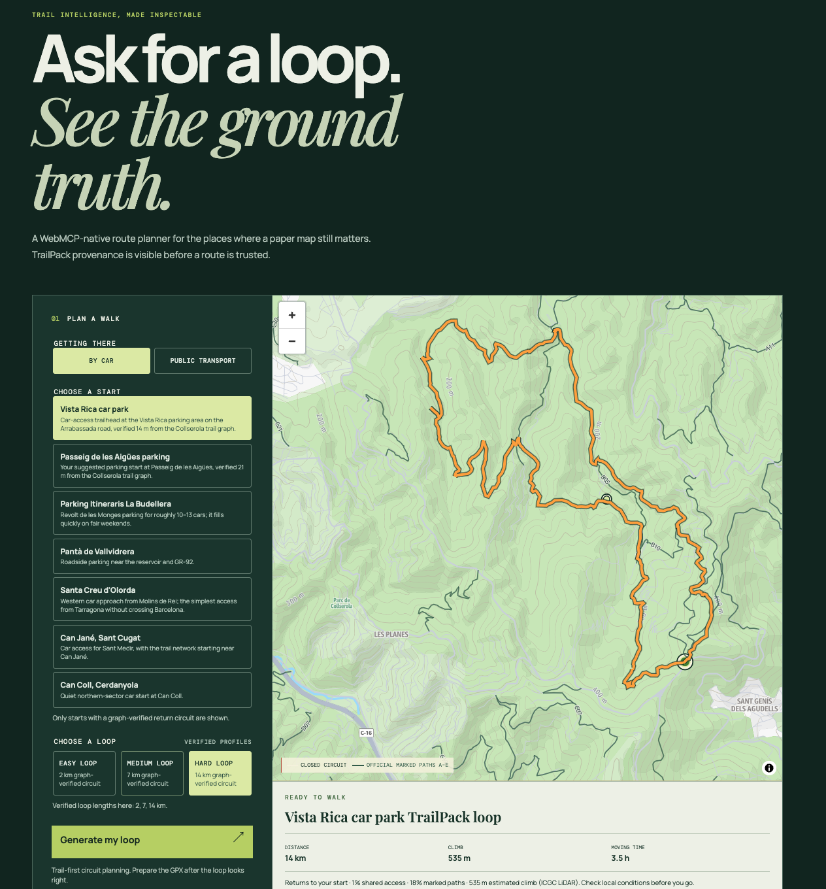

# Switchback

[](https://app.netlify.com/projects/switchback-mvp-igor/deploys)
[](LICENSE)

🚨 [Live Website](https://switchback-mvp-igor.netlify.app)

**Ask for a loop. See the ground truth.**

Switchback is a WebMCP-native planner for a short, car-accessible or transit-accessible walk in Collserola–Vallvidrera. A person and an agent work on the same map: the agent discovers site tools, chooses a graph-verified circuit, checks available forecast and Park-alert context, and leaves the resulting route visible for the person to inspect, brief to friends, and export.

**Live demo:** [switchback-mvp-igor.netlify.app](https://switchback-mvp-igor.netlify.app)

## Judge quick start — live WebMCP demo

**No account, login, API key, or credential is required.**

1. Open [the live Switchback demo](https://switchback-mvp-igor.netlify.app) in
   ChatGPT's in-app browser with site tools enabled, or in a Chrome profile
   where WebMCP is enabled.
2. Confirm the page says that its browser model context is connected, then use
   the visible **Copy agent test prompt** button (or paste the prompt below)
   into the agent conversation.
3. Watch the agent discover and call the page tools. The same tab will show its
   action in the worklog and ledger, render a loop on the map, and populate the
   route card with source-labelled planning context.
4. Ask the agent to prepare a family / friends briefing. Review it in the page
   and use the visible Copy control; optionally prepare GPX, then manually
   click **Download GPX**. The agent cannot send a message or auto-download a
   file.

```text
Use the site tools on this Switchback page. First call list_circuit_options and
choose a returned short, medium, or long distance profile; these are not
difficulty ratings. Call validate_circuit, then plan_route and
get_route_summary. Before discussing an evening hike, call
get_hiking_conditions with time_of_day evening, explain_difficulty, and
get_park_alerts with notice_limit 8. If either external source is unavailable,
state that the recommendation is based on TrailPack evidence only. Do not call
the hike safe: explain route evidence, forecast/daylight, official notices, and
what still needs local checking. Record the result with record_session_note.
```

Expected evidence: the map becomes a closed loop, the route card shows its
distance and sampled ascent, the agent action is visible in the shared ledger,
and forecast/official-alert panels clearly say whether their live source was
available. In a normal browser, Switchback's manual planner still works, but
the page labels this **browser-demo mode**; that is not a WebMCP verification.

The browser-native registration is in
[`web/src/webmcp.ts`](web/src/webmcp.ts), and the strict page-tool behavior is
documented in [WEBMCP.md](docs/WEBMCP.md).



## Why WebMCP

Trail planning is a shared decision, not a text answer. A generic assistant can suggest a scenic walk but cannot show whether that proposal closes as a non-retracing circuit on the map the person is looking at. Switchback gives the agent page-bound tools that act on the same TrailPack and route state as the UI.

The result is inspectable: a person can see the selected trailhead, rendered line, distance, sampled climb, marked-path coverage, GPX handoff, and every tool call in the visible worklog.

## What an agent can do

The app registers fourteen browser-native WebMCP tools:

1. List graph-verified circuit choices.
2. Dry-run a circuit before altering the map.
3. Record a visible session note.
4. Plan and render a closed circuit, with conversational live-context checks.
5. Summarize the active route.
6. Explain the route’s difficulty evidence and gaps.
7. Explain a TrailPack segment.
8. Avoid a segment and replan without silently changing a failed route.
9. Prepare a full-resolution GPX handoff.
10. Compare the next three local forecast days—including a 17:00–20:00 evening candidate plus sunrise/sunset—and identify a limited, least-exposed window.
11. Assemble transparent hiking decision support: route evidence, conservative difficulty, requested-time forecast/daylight, and official-alert availability—never a safety clearance.
12. Read the Park's official active-alert list, retaining original Catalan, source links, and optional English machine translations.
13. Prepare a reviewable, copyable briefing for a family / friends chat (with forecast and Park alerts when checked).
14. Describe the last accepted map edit.

For a live agent run, open the demo in a WebMCP-capable ChatGPT browser context and use the page’s **Copy agent test prompt** control. `plan_route` automatically gathers the non-blocking forecast and alert context in a browser; other actions remain explicit and inspectable. The app always shows whether a browser model context is connected.

## Honest route evidence

Switchback only offers starts and target lengths that its directed graph can close without a long retraced leg. The route card distinguishes the selected target from the rendered route distance; for example, a 3.5 km target may render as a 3.6 km circuit within the accepted tolerance.

Length profiles are **Short / Medium / Long**, never difficulty labels. `explain_difficulty` classifies a rendered route conservatively using sampled ICGC LiDAR ascent plus available OSM terrain tags. It returns `unrated` when those facts cannot support a responsible call.

The current TrailPack does **not** prove current signs, closures, weather, surface condition, obstacles, exposure, grade, or technical difficulty. Park marked-path preference is evidence from the published network, not a statement of present-day waymarking. Check local conditions before departure.

### Live context and translations

The route page compares the next three forecast days—including sunrise, sunset,
and an evening candidate—then reads the Park's active
official notices, and displays the original Catalan plus a clearly labelled
English machine translation. All of this is optional planning context: missing
or failed sources leave the graph-verified route intact and clearly marked as
TrailPack-only. The Park endpoint is server-side and rate-limited to 20
requests/IP/minute. See [operations and configuration](docs/OPERATIONS.md).

## Run locally

Prerequisites: Node 24+ and pnpm. Rust is only needed to rebuild TrailPack data.

```sh
pnpm --dir web install
pnpm --dir web dev
```

Open the local Vite URL. The manual planner works in any modern browser; agent tools require a browser that exposes a WebMCP model context.

Validate the shipped web app:

```sh
pnpm --dir web run build
pnpm --dir web run test
```

The offline evidence bundle is also available:

```sh
bash scripts/evaluate-mvp-offline.sh
```

## Data and reproducibility

The static TrailPack consists of 66 Collserola tiles with source records in its manifest. It combines OpenStreetMap trail data (ODbL) with the Park’s Dynamic Public-Use Network A–E, used as a preference signal where it helps close a route.

To rebuild the official overlay and tiles, follow the commands and source notes in [docs/MVP-EVALUATION.md](docs/MVP-EVALUATION.md). The app routes locally over the TrailPack; map tiles are a visual reference layer, not a routing dependency.

For the end-to-end preparation story—including graph normalisation, live
forecast/notice normalisation, translation safeguards, and release
validation—read [what Switchback prepares and normalises](docs/IMPLEMENTATION.md).

Useful supporting material:

- [How WebMCP works and complete tool reference](docs/WEBMCP.md)
- [What was prepared and normalised for the demo](docs/IMPLEMENTATION.md)
- [Operations, live data, translations, and safety boundaries](docs/OPERATIONS.md)
- [Submission video script](docs/VIDEO-SCRIPT.md)
- [Short demo walkthrough](docs/DEMO.md)
- [MVP evaluation evidence](docs/MVP-EVALUATION.md)
- [Apache-2.0 license](LICENSE)

## Devpost demo checklist

- [x] Public live URL
- [x] WebMCP registration and visible agent-tool worklog
- [x] No-login testing instructions and copy/paste live-agent prompt
- [x] End-to-end route generation and user-click GPX handoff
- [x] Open-source license file
- [x] Public GitHub repository
- [ ] Public, audible demo video under three minutes
- [ ] Devpost submission completed (not merely saved as a draft)
- [x] Solo submission — no teammates to invite

## License

Source code is licensed under [Apache-2.0](LICENSE). Third-party map tiles and trail datasets retain their respective terms and attributions.
